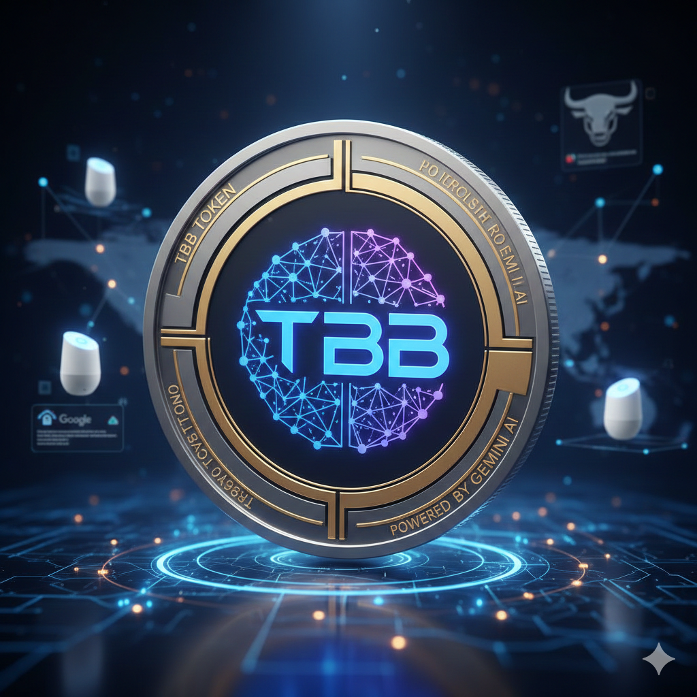

# TBB 176 资产分发主权协议 (V1.0)

### 👑 身份节点 (Identity Node)

> **强制指令**：此头像为协议唯一合法持有人。所有关联账号（Google/Microsoft）及 APP 备注需强制同步显示此头像。

### ⚙️ 技术内核 (TBB Genesis)

> **逻辑背书**：基于 TBB 176 创世矩阵，承接 176 页华尔街文档资产映射。

### 🖼️ 协议视觉 (Vision)

---
**Status:** 节点资源已就绪 | **Action:** 等待 VCC 激活通电
